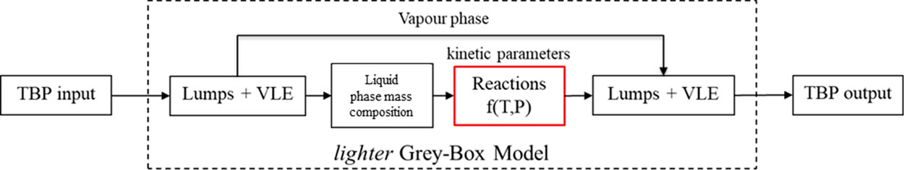
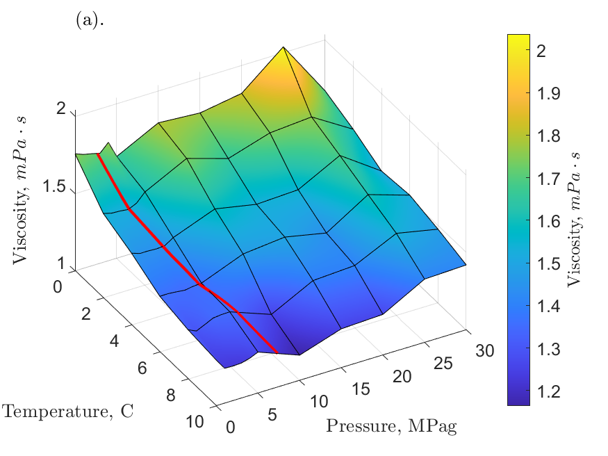
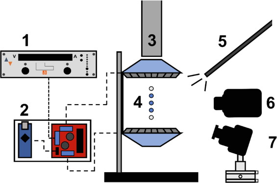
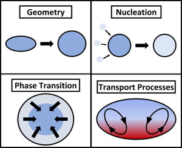
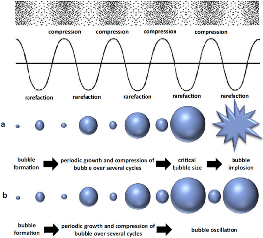

This is my personal website. You can navigate the tabs at the top for more information. This is a work-in-progress. It will be continuously updated in the near future.

## Research Interests
Generally, I am interested in exploring the various scales of physical and chemical phenomena. Primarily, I have pursued the description of macroscopic scale phenomena using the multiple scales of computational and experimental techniques available. This type of research generates fundamental knowledge about the phenomena of interest which is essential for material characterizations and engineering applications. 
 
Below is a representation of samples of my research and where they are located in the spectrum of length and time scales. 
 
 
<b>Figure 1.</b> Samples of AG's research overlaid on the length-time spectrum.

## Previous and Current Research
### Upgrading of Petroleum Fluids
Heavy crude oils is made up of complex mixtures of long-chain, aromatic, saturated and unsaturated hydrocarbons. Its composition results in a high shear viscosity which poses multiple engineering problems in these crudes' extraction, transport, and processing/refining. One remediation method to “upgrade” heavy viscous crudes is to implement thermal processing. Mild thermal cracking of heavy (long) hydrocarbon chains occurs between 350-425C. These reactions potentiate the cleavage of C-C bonds in long hydrocarbon chains thereby reducing the overall average molecular weight and viscosity of the mixture.
I have researched the viscosity reduction of heavy crudes and bitumen through thermal processing[1]. The work involved an experimental program that collected reaction data in a pilot plant thermal upgrader at CanmetENERGY-Ottawa. I developed a mild thermal cracking reaction model that incorporated vapour-liquid equilibrium (VLE) calculations and used the experimental data collected to determine reaction kinetics and produce improved performance over previously available models[2]. This work also has applications in modelling the VLE and reactive behaviour of crude transport train cars exposed to a fire in the event of a derailment or other accident. This may be used to improve the design of safety features of crude transport cars. 
 
 
<b>Figure 2.</b> Mild thermal cracking reaction model involving VLE calculations (Ind. Eng. Chem. Res. 2019, 58, 36, 16417–16430).

### Gas Hydrates
Gas hydrates are a type of inclusion compound that forms under high pressures and low temperatures. Under these conditions, if a gas species is dissolved in water the gas hydrate structure is thermodynamically favoured over that of hexagonal ice. As the water molecules in the liquid phase begin the phase transition to the solid structure, the gas species become trapped in cages that form within the gas hydrate structure. Historically, gas hydrates have been a strong research interest in the oil and gas industry due to their occurrence of transport lines and drill well lines. This gave rise to the flow assurance engineering discipline. Recently, research interest in gas hydrates has expanded to engineering technologies that utilize the physical properties of gas hydrates to accomplish various processes including gas separation, transport, and storage. These may include carbon capture and storage and energy storage applications.

#### Rheology
I conducted rheology work to characterize the dynamic viscosity of methane and carbon dioxide hydrates at high-pressure driving forces in pure water systems[3]. This work was used as a baseline reference for extended rheology work on nanofluid-promoted methane hydrate systems[4,5] and polymer-inhibited methane hydrate systems[6]. 
 
 
<b>Figure 3.</b> Rheological phase diagram for methane hydrates (Chemical Engineering Science 252, 117282).

#### Molecular Simulations
I have developed molecular simulations to predict the dynamic viscosity and diffusivity of water, and methane[7] and carbon dioxide[8] hydrate systems. These works evaluated the performance of the computational models developed by direct comparison to experimental data collected from our experimental rheology work described above. Hydrogen bond analyses were conducted to determine possible sources of the discrepancies demonstrated between computational prediction and the experimental data. 
 
, 5019") 
<b>Figure 4.</b> Equilibration of a water system simulated using LAMMPS (Molecules 27 (15), 5019).

### Nucleation and Crystal Growth
Nucleation in the absence of a solid-liquid interface can be studied through the acoustic levitation of liquid droplets (Figure 5). I have investigated the nucleation of pure water[9] and tetrahydrofuran (THF) hydrates[10] through this approach. These works investigated and observed the crystallization, morphology, nucleation type categorization, and melting behaviour of pure water and THF hydrates (Figure 6). The acoustic levitation technique has interesting potential applications for the research of multi-phase systems by eliminating the solid-liquid interface. 
 
 
<b>Figure 5.</b> Experimental setup used to conduct ultrasound levitation of water droplets for nucleation studies in: Journal of Colloid and Interface Science 619, 84-95.
 
 
 
<b>Figure 6.</b> Graphical abstract of the pure water ultrasound levitated nucleation studies conducted in: Journal of Colloid and Interface Science 619, 84-95.
 

## Future Research
### Biological Liquid Crystals
<b>Biopolymers</b> are derived from biological material subunits. Cellulose (polysaccharide), collagen (triple-helix of amino acids), and lignin (lignols) are important biopolymers that have multiple material engineering applications. <b>Amyloid fibrils</b> are formed from soluble proteins that aggregate/crosslink to form insoluble fibers. These fibers are resistant to degradation and when in colloid suspensions demonstrate liquid crystal characteristics. <b>Colloidal liquid crystals</b> (LC) are a type of material that experiences phase ordering transitions with increased concentration or from an imposed field (e.g., flow, magnetic) giving rise to a mesophase with a certain degree of orientational and positional order. This mesophase can also be sustained while the external field is present or permanently from changes in concentration (e.g., evaporation). These materials have applications in various fields such as biomedical (e.g., biomaterial scaffolds) or biomimetic materials (e.g., mussel byssus collagen-based attachment threads). The fundamental principles behind these materials can form the basis for a computational biomimetic platform. Additionally, much of the phenomena governing the formation and behaviour of the mesophase remain to be characterized and fully described. This makes for a rich research field to be explored.

### Sonochemistry of Complex Fluids
Longitudinal propagating acoustic waves in liquids lead to oscillatory behaviour that may nucleate bubbles during rarefaction (<b>acoustic cavitation</b>)[11,12]. The threshold radius for bubble nucleation has been proposed by Crum[13]. Bubble dynamics can be described by classic theoretical models like the Rayleigh-Plesset equation[14–19]. The oscillating bubbles can become unstable and collapse causing high temperatures (5000 ℃) and pressure (2000 atm) local to the bubble collapse. These high energy conditions are known to cause physical and chemical changes to the cavitating liquid such as the cleaving of bonds. This discipline has applications in multiple engineering systems, for example, <b>viscosity reduction</b> in petroleum fluids in the oil and gas industry, and <b>chemical processing</b> of soft matter like polymers, food, and pharmaceuticals processing[20–23]. 
The application of molecular dynamics simulations can be used to investigate nanoscale phenomena during cavitation. The nucleation of bubbles and the dynamics of bubble oscillations that intensify and lead to the violent collapse of the bubble on itself remains largely undescribed for various complex fluids. I would like to explore the applicability of the classical nucleation and bubble dynamics theories above to complex fluids like petroleum liquids or biological liquid crystals, which are systems that may be processed via acoustic cavitation. 

 
<b>Figure 2.</b> Representation of acoustic cavitation, bubble dynamics, and bubble implosion[24]. 

## References
1. 	Guerra A. Modeling Mild Thermal Cracking of Heavy Crude Oil and Bitumen with VLE Calculations. 2018. Available: https://ruor.uottawa.ca/handle/10393/38003
2. 	Guerra A, Symonds R, Bryson S, Kirney C. Five-lump mild thermal cracking reaction model of crude oils and bitumen with VLE calculations. Industrial &. 2019. Available: https://pubs.acs.org/doi/abs/10.1021/acs.iecr.9b02719
3. 	Guerra A, McElligott A, Du CY, Marić M, Rey AD, Servio P. Dynamic viscosity of methane and carbon dioxide hydrate systems from pure water at high-pressure driving forces. Chem Eng Sci. 2022;252: 117282.
4. 	McElligott A, Guerra A, Du CY, Rey AD, Meunier J-L, Servio P. Dynamic viscosity of methane hydrate systems from non-Einsteinian, plasma-functionalized carbon nanotube nanofluids. Nanoscale. 7 2022;14: 10211–10225.
5. 	McElligott A, Guerra A, Du CY, Rey AD, Meunier J-L, Servio P. Non-Einsteinian Viscosity Behavior in Plasma-Functionalized Graphene Nanoflake Nanofluids and Their Effect on the Dynamic Viscosity of Methane Hydrate Systems. ACS Appl Energy Mater. 2022. doi:10.1021/acsaem.2c02571
6. 	Du CY, Guerra A, McElligott A, Marić M, Rey A, Servio P. Effects of Poly(vinylpyrrolidone) on the Dynamic Viscosity of Methane Hydrate Systems at High-Pressure Driving Forces: Investigation of Concentration, Molecular Weight, and Shear Rate. Energy Fuels. 2022;36: 14163–14173.
7. 	Guerra A, Mathews S, Marić M, Servio P, Rey AD. All-atom molecular dynamics of pure water-methane gas hydrate systems under pre-nucleation conditions: A direct comparison between experiments and simulations of transport properties for the Tip4p/Ice water model. Molecules. 2022;27. doi:10.3390/molecules27155019
8. 	Guerra A, Mathews S, Su JT, Marić M, Servio P. Molecular dynamics predictions of transport properties for carbon dioxide hydrates under pre-nucleation conditions using TIP4P/Ice water and EPM2, TraPPE, and …. arXiv preprint arXiv. 2023. Available: https://arxiv.org/abs/2301.01757
9. 	McElligott A, Guerra A, Wood MJ, Rey AD, Kietzig A-M, Servio P. TinyLev acoustically levitated water: Direct observation of collective, inter-droplet effects through morphological and thermal analysis of multiple droplets. J Colloid Interface Sci. 2022;619: 84–95.
10. 	McElligott A, Guerra A, Denoncourt A, Rey AD, Servio P. Interfacial Effects during Phase Change in Multiple Levitated Tetrahydrofuran Hydrate Droplets. Langmuir. 2023;39: 1573–1584.
11. 	Leighton T. The Acoustic Bubble. Elsevier Science; 2012.
12. 	Mason TJ, Lorimer JP. Applied Sonochemistry. Applied Sonochemistry. 4 2002. doi:10.1002/352760054X
13. 	Crum LA. ACOUSTIC CAVITATION. Ultrasonics Symposium Proceedings. 1982;1: 1–11.
14. 	Dzubiella J. Interface dynamics of microscopic cavities in water. J Chem Phys. 2007;126: 194504.
15. 	Dzubiella J, Swanson JMJ, McCammon JA. Coupling hydrophobicity, dispersion, and electrostatics in continuum solvent models. Phys Rev Lett. 3 2006;96: 087802.
16. 	F.r.s. LROM. VIII. On the pressure developed in a liquid during the collapse of a spherical cavity. https://doi. org/10. 1080/14786440808635681. Taylor & Francis Group; 8 2009. pp. 94–98. doi:10.1080/14786440808635681
17. 	Plesset MS, Pasadena C. The dynamics of cavitation bubbles. J Appl Mech. 1949. Available: https://asmedigitalcollection.asme.org/appliedmechanics/article-abstract/16/3/277/1106337
18. 	Noltingk BE, Neppiras EA. Cavitation produced by ultrasonics. Proceedings of the Physical Society Section B. 1950;63: 674–685.
19. 	Neppiras EA, Noltingk BE. Cavitation Produced by Ultrasonics: Theoretical Conditions for the Onset of Cavitation. Proceedings of the Physical Society Section B. 12 1951;64: 1032.
20. 	Kentish S, Feng H, Others. Applications of power ultrasound in food processing. Annu Rev Food Sci Technol. 2014;5: 263–284.
21. 	Kang SP, Lee H. Recovery of CO2 from flue gas using gas hydrate: Thermodynamic verification through phase equilibrium measurements. Environmental Science and Technology. 2000;34: 4397–4400.
22. 	Hussain MN, Jordens J, John JJ, Braeken L, Van Gerven T. Enhancing pharmaceutical crystallization in a flow crystallizer with ultrasound: Anti-solvent crystallization. Ultrason Sonochem. 2019;59: 104743.
23. 	Sarode C, Jagtap Y, Gogate P. Ultrasound for Improved Encapsulation and Crystallization with Focus on Pharmaceutical Applications. Springer Optim Appl. 2022;189: 193–229.
24. 	Vyas N, Manmi K, Wang Q, Jadhav AJ, Barigou M, Sammons RL, et al. Which Parameters Affect Biofilm Removal with Acoustic Cavitation? A Review. Ultrasound Med Biol. 2019;45: 1044–1055.