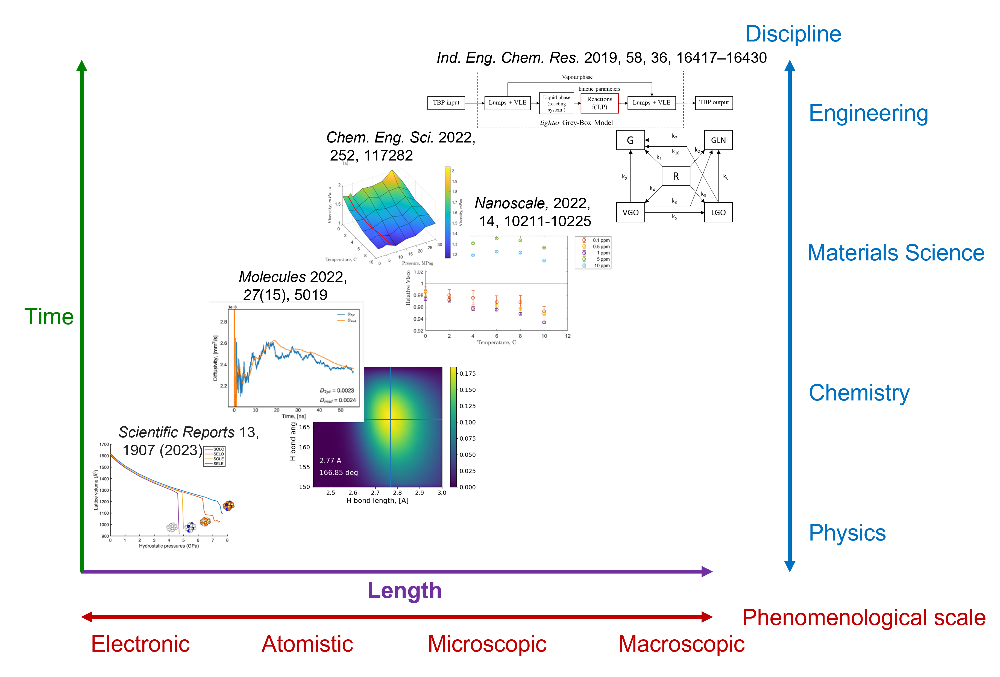

This is my personal website. You can navigate the tabs at the top for more information. This is a work-in-progress. It will be continuously updated in the near future.

## Research Interests
Generally, I am interested in the various scales of physical and chemical phenomena. Particularly, the description of macroscopic scale phenomena using the various scales of computational and experimental techniques available. This research generates fundamental knowledge about the phenomena of interest which is essential for material sciences characterizations and engineering applications. 
 
Below is a representation of some samples of my research and where they are located in the spectrum of length and time scales. 
 

## Future Research
### Biological Liquid Crystals
<b>Biopolymers</b> are derived from biological material subunits. Cellulose (polysaccharide), collagen (triple-helix of amino acids), and lignin (lignols) are important biopolymers that have multiple material engineering applications. <b>Amyloid fibrils</b> are formed from soluble proteins that aggregate/crosslink to form insoluble fibers. These fibers are resistant to degradation and when in colloid suspensions demonstrate liquid crystal characteristics. <b>Colloidal liquid crystals</b> (LC) are a type of material that experiences phase ordering transitions with increased concentration or from an imposed field (e.g., flow, magnetic) giving rise to a mesophase with a certain degree of orientational and positional order. This mesophase can also be sustained while the external field is present or permanently from changes in concentration (e.g., evaporation). These materials have applications in various fields such as biomedical (e.g., biomaterial scaffolds) or biomimetic materials (e.g., mussel byssus collagen-based attachment threads). The fundamental principles behind these materials can form the basis for a computational biomimetic platform. Additionally, much of the phenomena governing the formation and behaviour of the mesophase remain to be characterized and fully described. This makes for a rich research field to be explored.

### Sonochemistry of Complex Fluids
Longitudinal propagating acoustic waves in liquids lead to oscillatory behaviour that may nucleate bubbles during rarefaction[1,2]. The threshold radius for bubble nucleation has been proposed by Crum[3]. Bubble dynamics can be described by classic theoretical models like the Rayleigh-Plesset equation[4–9]. The oscillating bubbles can become unstable and collapse causing high temperatures (5000 ℃) and pressure (2000 atm) local to the bubble collapse. These high energy conditions are known to cause physical and chemical changes to the cavitating liquid such as the cleaving of bonds.
This discipline has applications in multiple engineering systems, for example, viscosity reduction in petroleum fluids in the oil and gas industry, and chemical processing of soft matter like polymers, food, and pharmaceuticals processing[10,11–14].

### References
1. 	Leighton T. The Acoustic Bubble. Elsevier Science; 2012.
2. 	Mason TJ, Lorimer JP. Applied Sonochemistry. Applied Sonochemistry. 4 2002. doi:10.1002/352760054X
3. 	Crum LA. ACOUSTIC CAVITATION. Ultrasonics Symposium Proceedings. 1982;1: 1–11.
4. 	Dzubiella J. Interface dynamics of microscopic cavities in water. J Chem Phys. 2007;126: 194504.
5. 	Dzubiella J, Swanson JMJ, McCammon JA. Coupling hydrophobicity, dispersion, and electrostatics in continuum solvent models. Phys Rev Lett. 3 2006;96: 087802.
6. 	F.r.s. LROM. VIII. On the pressure developed in a liquid during the collapse of a spherical cavity. https://doi. org/10. 1080/14786440808635681. Taylor & Francis Group; 8 2009. pp. 94–98. doi:10.1080/14786440808635681
7. 	Plesset MS, Pasadena C. The dynamics of cavitation bubbles. J Appl Mech. 1949. Available: https://asmedigitalcollection.asme.org/appliedmechanics/article-abstract/16/3/277/1106337
8. 	Noltingk BE, Neppiras EA. Cavitation produced by ultrasonics. Proceedings of the Physical Society Section B. 1950;63: 674–685.
9. 	Neppiras EA, Noltingk BE. Cavitation Produced by Ultrasonics: Theoretical Conditions for the Onset of Cavitation. Proceedings of the Physical Society Section B. 12 1951;64: 1032.
10. 	Kang SP, Lee H. Recovery of CO2 from flue gas using gas hydrate: Thermodynamic verification through phase equilibrium measurements. Environmental Science and Technology. 2000;34: 4397–4400.
11. 	Kentish S, Feng H, Others. Applications of power ultrasound in food processing. Annu Rev Food Sci Technol. 2014;5: 263–284.
12. 	Natarajan S, Ponnusamy V. A review on the applications of ultrasound in food processing. Materials Today: Proceedings. 2020. doi:10.1016/J.MATPR.2020.09.516
13. 	Hussain MN, Jordens J, John JJ, Braeken L, Van Gerven T. Enhancing pharmaceutical crystallization in a flow crystallizer with ultrasound: Anti-solvent crystallization. Ultrason Sonochem. 2019;59: 104743.
14. 	Sarode C, Jagtap Y, Gogate P. Ultrasound for Improved Encapsulation and Crystallization with Focus on Pharmaceutical Applications. Springer Optim Appl. 2022;189: 193–229.